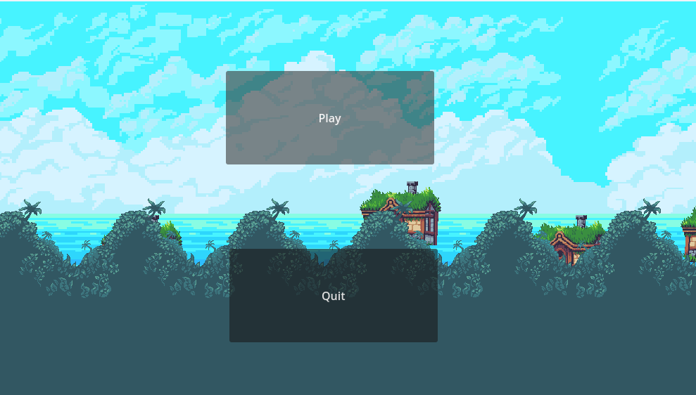
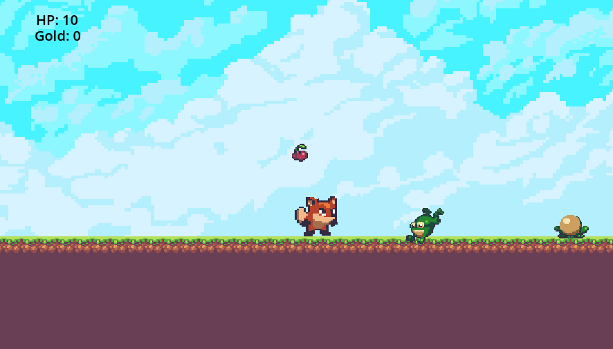

**********************************************************************
		PLATFORMER 
		
	Author: Emilija Zdilar
	Version: 1.0.0
	Date: 01.04.2024.

	This project is an Introduction to Godot assignment. 
	It is a rudimental platformer game, made by Godot Engine. 
	 		
**********************************************************************

Getting Started:

- Download and open project
- Launch Godot and open the project
- Run the game

**********************************************************************

Example: 
  

**********************************************************************

Prerequisites:
- Godot 4

**********************************************************************

Acknowledgments:
-  Godot Game Development – Crash Course for Beginners by freeCode,
   by freeCodeCamp.org	
	
**********************************************************************